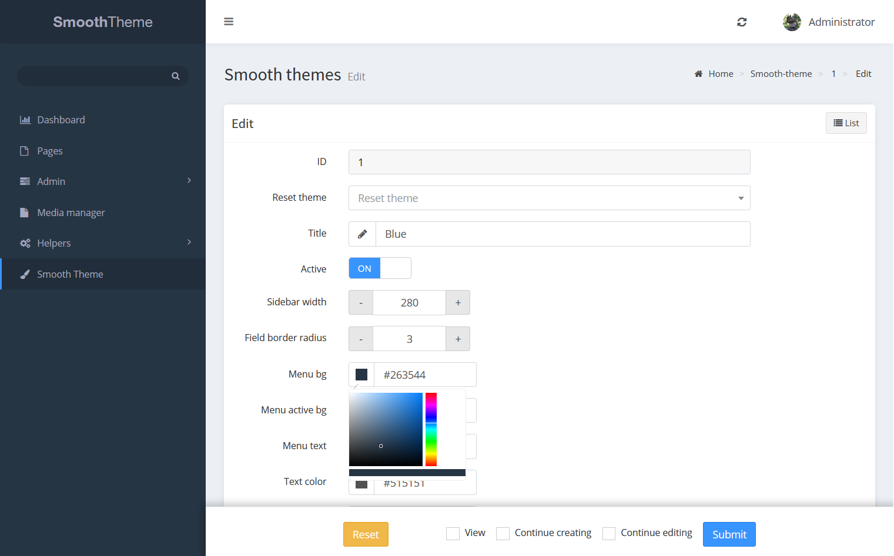

# Smooth Theme for laravel-admin

This is a `laravel-admin` (z-song) extension that makes the default bootstrap theme a bit more smooth also it provides an editor to adjust colors and settings

## Screenshot



## Installation

```bash
// step 1, make repository available in composer.json
"repositories": [
    { "name": "laravel-admin-ext/smooth-theme", "type": "git", "url": "https://github.com/wishbone-productions/smooth-theme" }
],

// step 2
composer require laravel-admin-ext/smooth-theme

// step 3
php artisan vendor:publish --provider="Encore\SmoothTheme\SmoothThemeServiceProvider"

// step 4
php artisan migrate

// step 5
php artisan admin:import smooth-theme
```

## notes
make sure storage link is created

## Features
- a more smooth theme
- changes defautl grid actions
- disabled default color skin

options page
- menu width
- custom colors
- field border radius
- multiple themes
